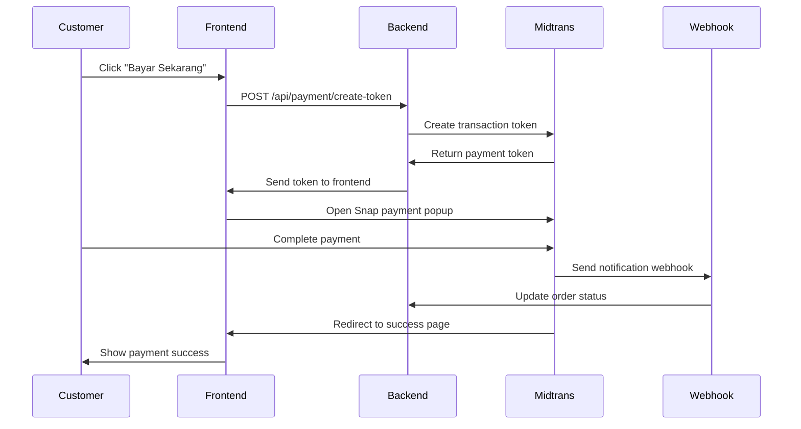

# 💳 Midtrans Payment Gateway Integration

Panduan lengkap setup dan konfigurasi Midtrans payment gateway untuk platform Katering Aqiqah.

## 🚀 Overview

Integrasi Midtrans memungkinkan customer untuk melakukan pembayaran menggunakan:
- 💳 **Kartu Kredit/Debit**: Visa, Mastercard, JCB
- 🏦 **Virtual Account**: BCA, BNI, BRI, Mandiri, Permata
- 📱 **E-Wallet**: GoPay, OVO, DANA, LinkAja, ShopeePay
- 🏪 **Retail Outlet**: Indomaret, Alfamart
- 💰 **QRIS**: Semua aplikasi yang support QRIS

## 📋 Prerequisites

1. **Akun Midtrans**
   - Daftar di [Midtrans Dashboard](https://dashboard.midtrans.com/)
   - Verifikasi akun bisnis Anda
   - Dapatkan Server Key dan Client Key

2. **Environment Variables**
   - Copy dari `env.example` ke `.env.local`
   - Isi credential Midtrans

## ⚙️ Setup Instructions

### 1. Daftar Akun Midtrans

1. Kunjungi [Midtrans Dashboard](https://dashboard.midtrans.com/)
2. Daftar sebagai merchant
3. Lengkapi data bisnis
4. Verifikasi dokumen yang diperlukan

### 2. Dapatkan API Keys

1. Login ke Midtrans Dashboard
2. Pilih environment:
   - **Sandbox**: Untuk testing
   - **Production**: Untuk live/real transactions

3. Copy keys yang diperlukan:
   ```
   Server Key: SB-Mid-server-xxxxx (untuk sandbox)
   Client Key: SB-Mid-client-xxxxx (untuk sandbox)
   ```

### 3. Update Environment Variables

Edit file `.env.local`:

```bash
# Midtrans Configuration
MIDTRANS_SERVER_KEY=SB-Mid-server-your-server-key-here
MIDTRANS_CLIENT_KEY=SB-Mid-client-your-client-key-here
NEXT_PUBLIC_MIDTRANS_CLIENT_KEY=SB-Mid-client-your-client-key-here

# Environment: sandbox or production
MIDTRANS_ENVIRONMENT=sandbox

# App URL untuk callback
NEXT_PUBLIC_APP_URL=http://localhost:3000
```

### 4. Setup Webhook Notification

1. Login ke Midtrans Dashboard
2. Masuk ke **Settings** → **Configuration**
3. Set **Notification URL**:
   ```
   Development: http://localhost:3000/api/payment/webhook
   Production: https://yourdomain.com/api/payment/webhook
   ```

4. Set **Finish/Unfinish/Error Redirect URL**:
   ```
   Finish: https://yourdomain.com/payment/success
   Unfinish: https://yourdomain.com/payment/pending
   Error: https://yourdomain.com/payment/error
   ```

## 🔧 File Structure

```
📁 Integrasi Midtrans
├── 📄 lib/midtrans/
│   └── config.ts                 # Konfigurasi Midtrans client
├── 📄 lib/services/
│   └── payment.ts               # Service untuk handle payment
├── 📄 app/api/payment/
│   ├── create-token/route.ts    # API create payment token
│   ├── webhook/route.ts         # Webhook handler
│   └── status/route.ts          # Check payment status
├── 📄 components/payment/
│   └── midtrans-payment.tsx     # Payment UI component
├── 📄 components/order/
│   └── order-card.tsx          # Updated dengan payment button
└── 📄 app/payment/
    ├── success/page.tsx         # Payment success page
    ├── pending/page.tsx         # Payment pending page
    └── error/page.tsx           # Payment error page
```

## 🛠️ Core Features

### 1. **Payment Token Creation**
- Generate secure payment token dari server
- Include customer dan item details
- Set callback URLs

### 2. **Snap Payment UI**
- Load Midtrans Snap.js
- Modal popup untuk payment
- Multiple payment methods

### 3. **Payment Status Tracking**
- Real-time notification via webhook
- Auto-update order status
- Payment verification

### 4. **Error Handling**
- Comprehensive error messages
- Retry payment functionality
- Fallback mechanisms

## 📊 Payment Flow



## 🔐 Security Features

### 1. **Signature Verification**
- Webhook notifications diverifikasi dengan SHA512
- Mencegah fraud dan manipulasi data

### 2. **Server-side Token Generation**
- Payment token dibuat di server
- Credentials tidak exposed ke client

### 3. **Environment Isolation**
- Sandbox untuk testing
- Production untuk live transactions

## 🧪 Testing

### 1. **Test Cards (Sandbox)**

**Credit Card Success:**
```
Card Number: 4811 1111 1111 1114
CVV: 123
Exp: 12/25
```

**Credit Card Failed:**
```
Card Number: 4911 1111 1111 1113
CVV: 123
Exp: 12/25
```

### 2. **Virtual Account Testing**
- BCA VA: Akan generate VA number
- Transfer dengan nominal exact sesuai yang diminta

### 3. **E-Wallet Testing**
- GoPay: Akan redirect ke GoPay simulator
- OVO: Test dengan flow simulator

## 📋 Payment Methods Configuration

Anda bisa enable/disable payment methods di Midtrans Dashboard:

### **Kartu Kredit/Debit**
- Visa, Mastercard, JCB
- 3D Secure authentication
- Installment options

### **Bank Transfer**
- Virtual Account: BCA, BNI, BRI, Mandiri
- Permata VA
- Real-time notification

### **E-Wallet**
- GoPay (QR & deep link)
- OVO
- DANA
- LinkAja
- ShopeePay

### **Retail Outlet**
- Indomaret
- Alfamart
- Payment via store

## 🔄 Order Status Mapping

| Midtrans Status | Order Status | Payment Status |
|----------------|-------------|----------------|
| `pending` | `pending` | `pending` |
| `settlement` | `confirmed` | `paid` |
| `capture` | `confirmed` | `paid` |
| `deny` | `cancelled` | `failed` |
| `cancel` | `cancelled` | `failed` |
| `expire` | `cancelled` | `failed` |

## 📞 Support & Troubleshooting

### **Common Issues**

1. **"Invalid Server Key"**
   - Pastikan server key benar
   - Check environment (sandbox vs production)

2. **"Payment popup tidak muncul"**
   - Verify client key di environment variables
   - Check console untuk JavaScript errors

3. **"Webhook tidak diterima"**
   - Verify webhook URL di Midtrans Dashboard
   - Check firewall settings
   - Ensure endpoint accessible dari internet

### **Debug Mode**

Enable logging untuk debugging:

```javascript
// Tambahkan di browser console
localStorage.setItem('debug', 'midtrans:*')
```

### **Test Webhook**

Test webhook secara manual:

```bash
# Test webhook endpoint
curl -X GET http://localhost:3000/api/payment/webhook

# Expected response
{
  "message": "Midtrans webhook endpoint is active",
  "timestamp": "2024-01-20T10:30:00.000Z"
}
```

## 🚀 Go Live Checklist

### **Sebelum Production:**

- [ ] Ganti ke Production Server/Client Key
- [ ] Update `MIDTRANS_ENVIRONMENT=production`
- [ ] Update webhook URL ke domain production
- [ ] Test semua payment methods
- [ ] Verify signature validation
- [ ] Setup monitoring dan logging

### **Documentation Links:**

- [Midtrans Documentation](https://docs.midtrans.com/)
- [Snap API Reference](https://snap-docs.midtrans.com/)
- [Payment Methods](https://docs.midtrans.com/en/core-api/bank-transfer)
- [Webhook Notification](https://docs.midtrans.com/en/after-payment/http-notification)

---

## 🎉 Integration Complete!

Dengan setup ini, customer bisa melakukan pembayaran dengan mudah dan aman. Semua transaksi akan tracked dengan baik dan status order akan otomatis terupdate.

**Happy Coding! 🚀**

